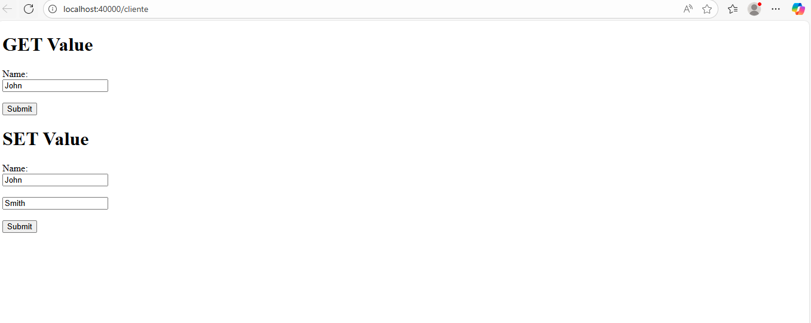
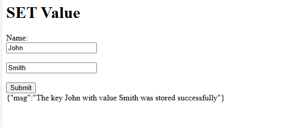
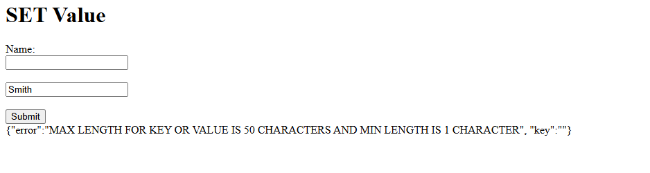
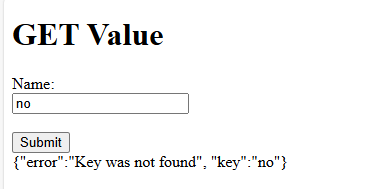

# Parcial Arep Tercio 1
Construir un servicio web que permita almacenar llaves con su valor y consultarlas.

## Instalacion

```
mvn clean install
```

## Ejecución

Clase del HttpServer
```
java -cp .\target\classes org.eci.arep.t1.HttpServer
```
Clase FacadeServer
```
java -cp .\target\classes org.eci.arep.t1.FacadeServer
```

## Ejemplo de uso
Se deben estar ejecutando el HttpServer y el FacadeServer
Ve a un browser y escribe http://localhost:40000/cliente

Dale click al boton del SetValue

Dale click al boton de GetValue


Ejemplo de los errores

Longitud de llave y valor

Llave no existe


### Link video
https://pruebacorreoescuelaingeduco-my.sharepoint.com/:v:/g/personal/diego_macia-d_mail_escuelaing_edu_co/EZmnlIZwSw9MvwLpAbvDCtgBMEwhzj5jeda-oxtS6A5aLA?nav=eyJyZWZlcnJhbEluZm8iOnsicmVmZXJyYWxBcHAiOiJPbmVEcml2ZUZvckJ1c2luZXNzIiwicmVmZXJyYWxBcHBQbGF0Zm9ybSI6IldlYiIsInJlZmVycmFsTW9kZSI6InZpZXciLCJyZWZlcnJhbFZpZXciOiJNeUZpbGVzTGlua0NvcHkifX0&e=pROR3m
